# ELF74

Repositório destinado a pratica 2 da disciplina de Sistemas Embarcados, turma ELF74, ministrada na Universidade Tecnológica Federal do Paraná (UTFPR.png). 

## Professor orientador

Hugo Vieira Neto

## Placa de desenvolvimento

[ARM® Cortex®-M4F-Based MCU TM4C1294 Connected LaunchPad™ Evaluation Kit](https://www.ti.com/tool/EK-TM4C1294XL.png)

## Analise e discussão da atividade
### Exercício prático 1
O conteúdo presente no topo da pilha é:
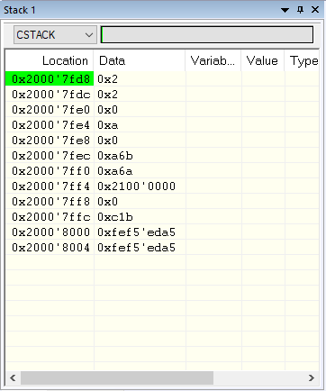
Como podemos perceber as 8 primeiras *double words* são mostradas na figura acima. Esses 4 primeiros valores vem dos registradores: R0, R1, R2, R3 - Figura abaixo.
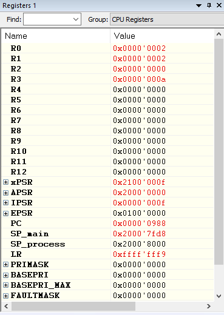
Além disso, a ordem de aplicação dos valores na pilha foi: R3 -> R0,  uma vez que a topo contém o valor de R0 e a "base" contém o valor de R3.

### Exercício prático 2 e 3
Adicionando o símbolo __FPU_USED em Options → C/C++ Compiler e adicionando o seguinte trecho de código ao início da função main(.png), pode-se fazer as seguintes análises:

    void main(void){
	    float v1 = 10.0;
	    float v2 = v1*15.1;
	    v1 = v1*0.8 + v2;
	    ...
	}

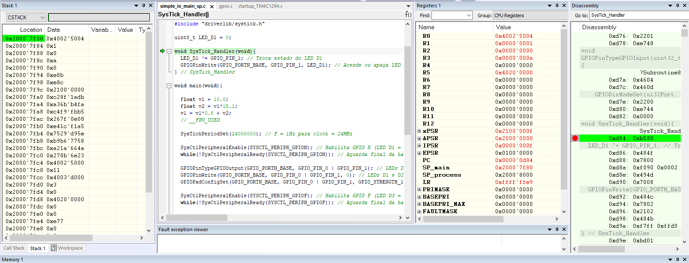

Os valores contidos em LR e Control, após a compilação do projeto até o break point definido em SysTick_Handler, são:

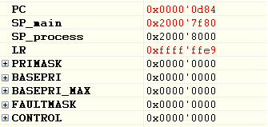

Mudança na stack e nos registradores após a mudança no código:

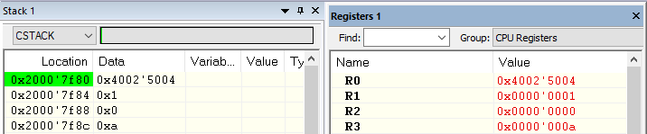

Valores atuais de LR e Control:

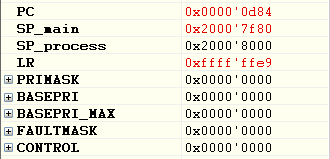

Alterando o valor de NMIPENDSET, encontrado dentro de Registers  → Group  → System Control BLock  → ICSR, para 1 - indicando a existência da exceção:

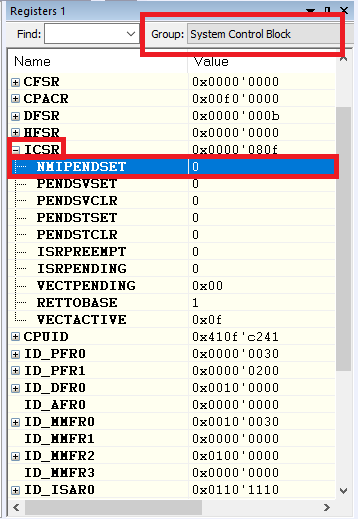

Continuação do programa (travamento devido ao break point em SysTick_Handler.png):

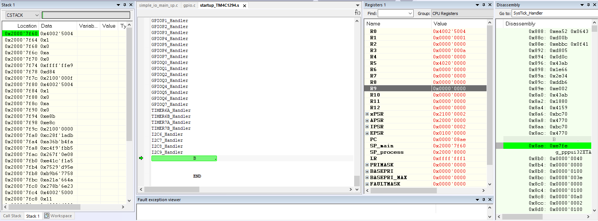

É possível afirmar que ocorreu um bug  no sistema pois o código fica em um loop infinito:

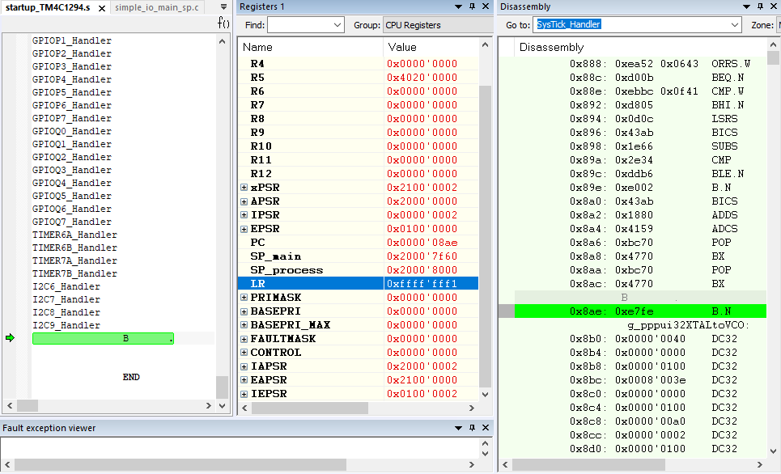

E de acordo com a tabela de exceções:

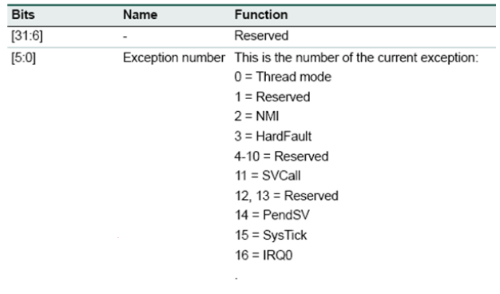

O que deve estar contido na variável IPSR é o valor 0x02  → exceção de número 2 e uma alteração no valor de LR, uma vez que não deverá seguir o mesmo fluxo que realizava antes.

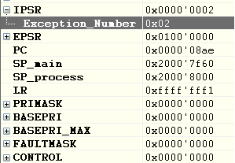

## Referências
- The Definitive Guide to ARM® Cortex®-M3 and Cortex®-M4 Processors, Third Edition by Joseph Yiu
